# Mermaid Diagramming Standards

Comprehensive standards and best practices for creating effective Mermaid diagrams across all diagram types.

## Core Principles

This content applies the following foundational principles:

- [Code Quality Goals](../core/principles/code-quality-goals.md) - Clear, readable diagrams
- [Design by Contract](../core/principles/design-by-contract.md) - Explicit relationships and contracts

---

## Mermaid Overview

**Mermaid** is a JavaScript-based diagramming and charting tool that uses a simple, markdown-inspired syntax to create diagrams dynamically.

**17 Supported Diagram Types**:

1. Flowchart
2. Sequence Diagram
3. Class Diagram
4. State Diagram
5. Entity Relationship Diagram (ERD)
6. User Journey
7. Gantt Chart
8. Pie Chart
9. Quadrant Chart
10. Requirement Diagram
11. Gitgraph
12. C4 Diagram
13. Mindmap
14. Timeline
15. Sankey Diagram
16. XY Chart
17. Block Diagram

---

## Flowchart Syntax & Standards

### Basic Syntax

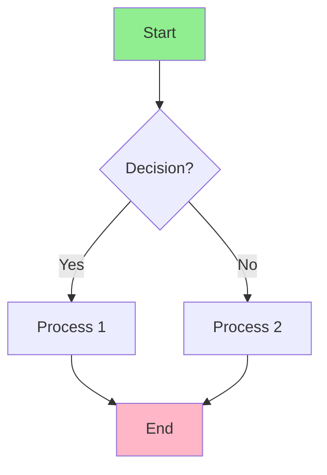

### Node Shapes

```
[]      Rectangle
()      Rounded rectangle
{}      Diamond (decision)
(())    Circle
[[]]    Subroutine
[()]    Stadium-shaped
>]      Asymmetric
```

### Directions

- `TD` or `DT` - Top-down (default)
- `LR` or `RL` - Left-right
- `BT` - Bottom-top

### Connection Types

```
-->     Solid arrow
--text-->   Arrow with label
-.->    Dotted arrow
==>     Thick arrow
```

### Best Practices

✅ **Do**:

- Start with clear entry point (Start node)
- Use consistent shapes for similar actions
- Binary decision points when possible
- Use subgraphs for grouping related processes
- Color-code by domain or status
- Keep labels concise and action-oriented
- Left-to-right flow for readability

❌ **Don't**:

- Create decision nodes with >2 outcomes (use multiple diamonds)
- Mix flow directions unnecessarily
- Overload with colors
- Use vague labels ("Process", "Do Something")
- Create cyclic flows without clear loop back labels
- Put too many nodes on one level

### Subgraphs for Organization

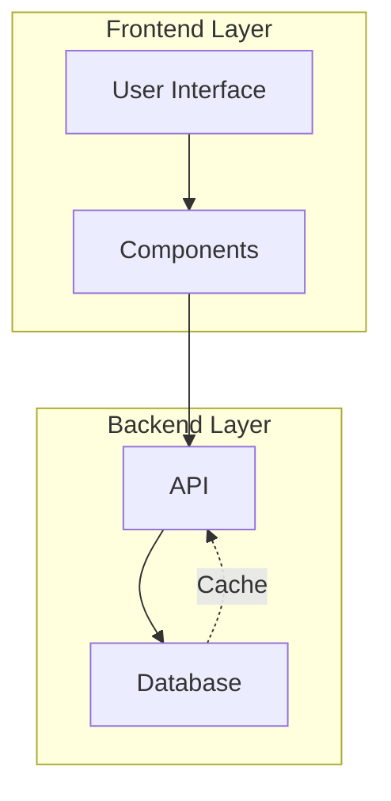

### Styling Patterns

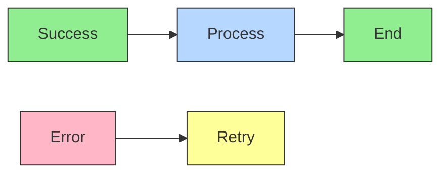

---

## Sequence Diagram Syntax & Standards

### Basic Syntax

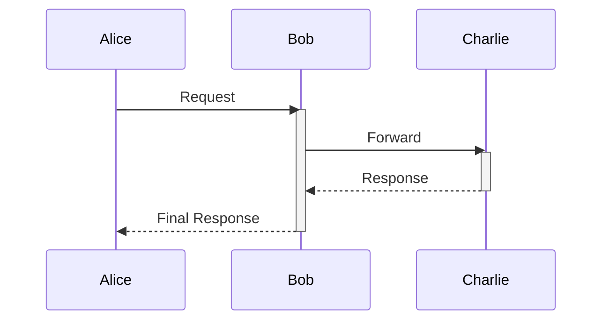

### Arrow Types

```
->      Solid arrow
-->     Dotted arrow
->>     Solid arrow with filled head
-->>    Dotted arrow with filled head
-x      Solid line with cross
-)      Solid line with open arrow
```

### Participant Ordering

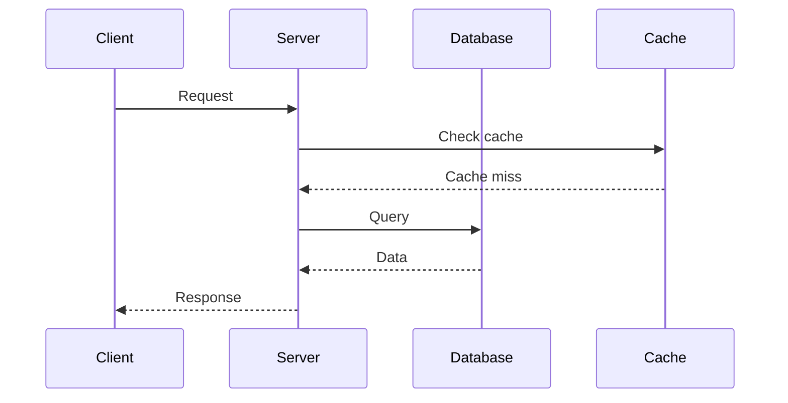

### Control Flow (alt, else, loop, par, etc.)

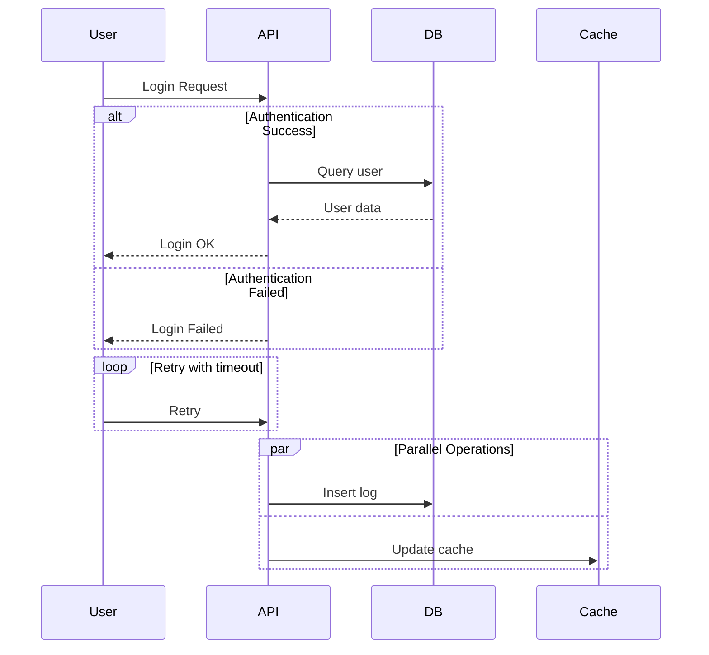

### Notes and Comments

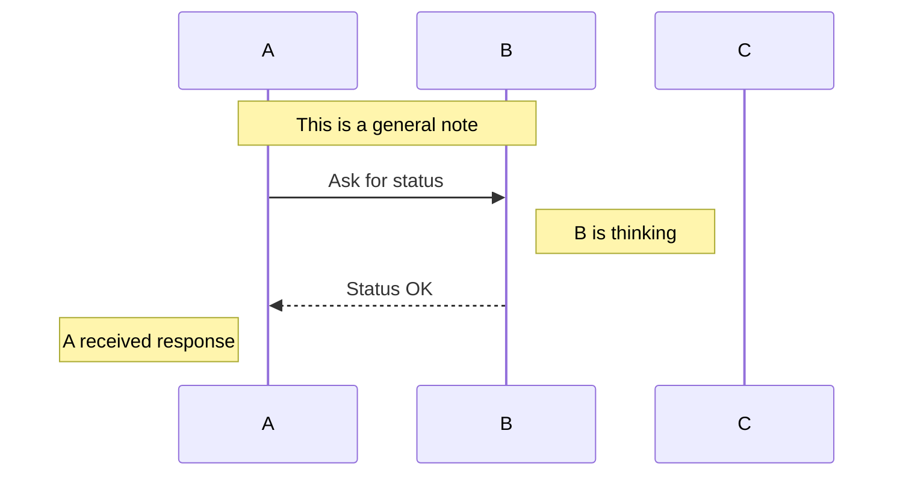

### Best Practices

✅ **Do**:

- Order participants logically (client → service → database)
- Use activation boxes to show processing time
- Include both requests and responses
- Add notes for important decisions
- Use clear, action-oriented labels
- Break complex sequences into multiple diagrams
- Show error paths and edge cases

❌ **Don't**:

- Create overly long sequences (>15 interactions)
- Reorder participants mid-diagram
- Use vague message labels
- Omit response messages
- Create deeply nested alt/else blocks

---

## Class Diagram Syntax & Standards

### Basic Syntax

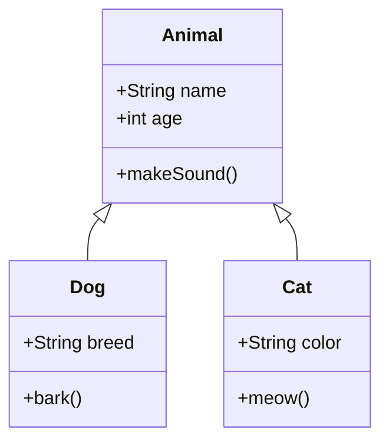

### Relationships

```
<|--     Inheritance
*--      Composition (filled diamond)
o--      Aggregation (empty diamond)
-->      Association
..>      Dependency
..|>     Realization
```

### Visibility Modifiers

```
+        Public
-        Private
#        Protected
~        Package/internal
```

### Method/Property Syntax

```
+String name                    Property with type
+getName() String              Method with return type
+setName(String name) void     Method with parameters
+static calculateAge() int      Static method
*--instanceOf() String         Abstract method (asterisk prefix)
```

### Class Structure

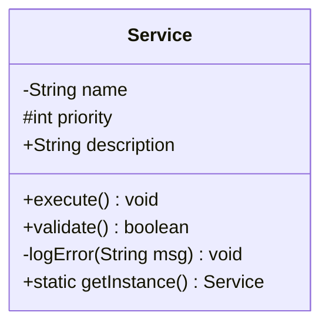

### Best Practices

✅ **Do**:

- Show only relevant attributes/methods
- Use proper visibility modifiers
- Include key relationships
- Group related classes
- Use inheritance hierarchies clearly
- Keep class names as entity types (noun)
- Show method return types and parameters

❌ **Don't**:

- Include every property/method (show essential ones)
- Mix concerns in one class
- Create overly deep inheritance hierarchies
- Use vague class names
- Show internal implementation details

---

## State Diagram Syntax & Standards

### Basic Syntax

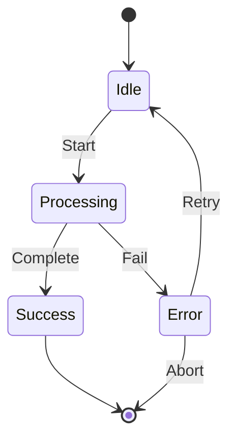

### Composite States

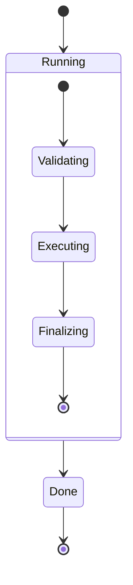

### State Actions

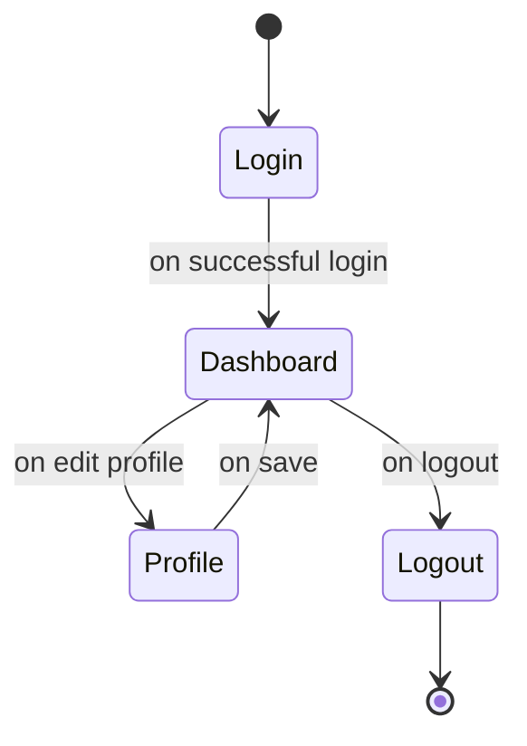

### Best Practices

✅ **Do**:

- Show all possible states
- Label transitions clearly with triggers
- Use composite states for complexity
- Mark initial and final states with `[*]`
- Use action verbs on transitions
- Keep state names as noun phrases
- Show guards on transitions when needed

❌ **Don't**:

- Create ambiguous state names
- Omit transitions (show all valid flows)
- Create unreachable states
- Mix states and actions as state names
- Create circular loops without clear conditions

---

## Entity Relationship Diagram (ERD) Syntax

### Basic Syntax

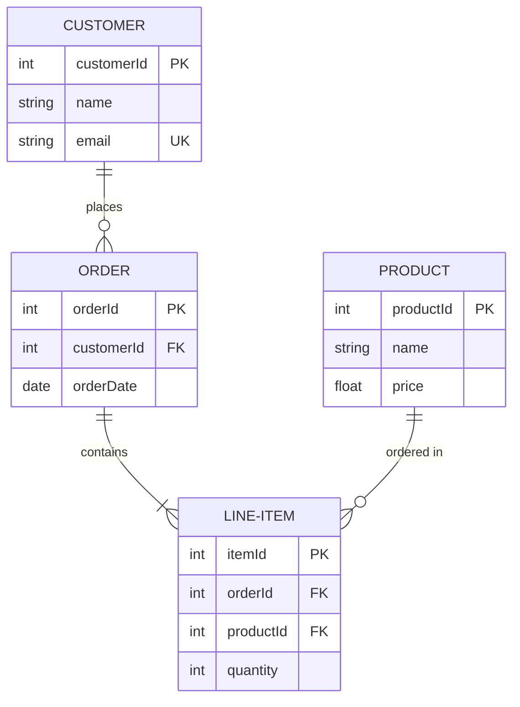

### Cardinality Notation

```
||      One
o{      Many
||--||  One-to-One
||--o{  One-to-Many
}o--o{  Many-to-Many
```

### Field Modifiers

```
PK      Primary Key
FK      Foreign Key
UK      Unique Key
```

### Best Practices

✅ **Do**:

- Show all key relationships
- Use proper cardinality notation
- Include primary and foreign keys
- Use meaningful table/column names
- Show derived tables if relevant
- Group related entities

❌ **Don't**:

- Include every column (show key ones)
- Use ambiguous cardinality
- Mix entity and attribute names
- Create circular relationships without purpose

---

## Gantt Chart Syntax & Standards

### Basic Syntax

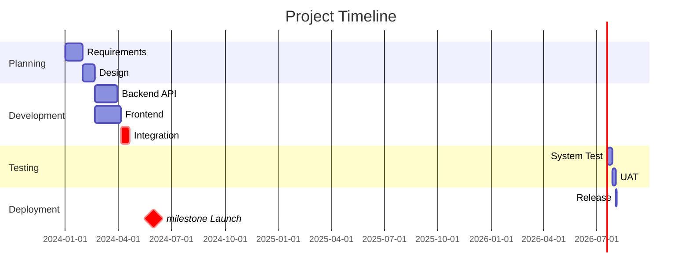

### Task States

```
DONE        Completed (green)
ACTIVE      In progress (blue)
CRIT        Critical path (red)
MILESTONE   Milestone marker
```

### Date Formats

```
YYYY-MM-DD      Standard format
YYYY/MM/DD      Alternative format
HH:mm           With time
```

### Best Practices

✅ **Do**:

- Use realistic timelines
- Show task dependencies
- Mark critical path
- Include milestones
- Group by phase/team
- Use consistent date formats
- Show parallel work

❌ **Don't**:

- Create unrealistic durations
- Omit dependencies
- Use vague task names
- Overcrowd sections
- Miss critical milestones

---

## Color Standards

### Semantic Colors

```
#90EE90     Green    - Success, start, positive, approved
#FFB6C6     Pink/Red - Error, end, negative, rejected
#FFFF99     Yellow   - Warning, attention, pending
#B6D7FF     Blue     - Information, process, active
#E6B6FF     Purple   - Special, highlight, important
#D3D3D3     Gray     - Inactive, disabled, deprecated
#FFA500     Orange   - In progress, intermediate
```

### Consistency Rules

- Use same color for same semantic meaning across diagrams
- Avoid pure red/green (colorblind accessibility)
- Use background colors for grouping, stroke for emphasis
- Limited palette: max 5-6 colors per diagram

### Accessibility

```
✅ Good color pairs (colorblind safe):
   Blue + Orange
   Blue + Yellow
   Purple + Yellow

❌ Avoid (not colorblind safe):
   Red + Green
   Red + Brown
   Green + Brown
```

---

## Theme Configuration

### Applying Themes

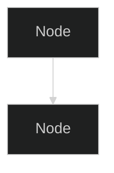

### Available Themes

- `default` - Light, neutral theme
- `neutral` - Neutral color scheme
- `dark` - Dark background
- `forest` - Green-based theme
- `base` - Minimal styling

### Custom Configuration

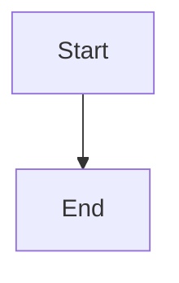

---

## Advanced Features

### Comments


### Link Interactions

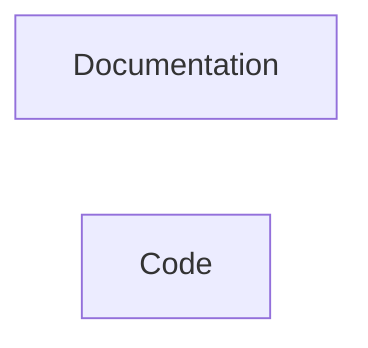

### Callback Functions (JavaScript)

```javascript
const diagram = {
    id: 'mermaid-example',
    nodes: {
        'A': { label: 'Start', callback: () => console.log('Node A clicked') }
    }
};
```

### Subgraph Styling

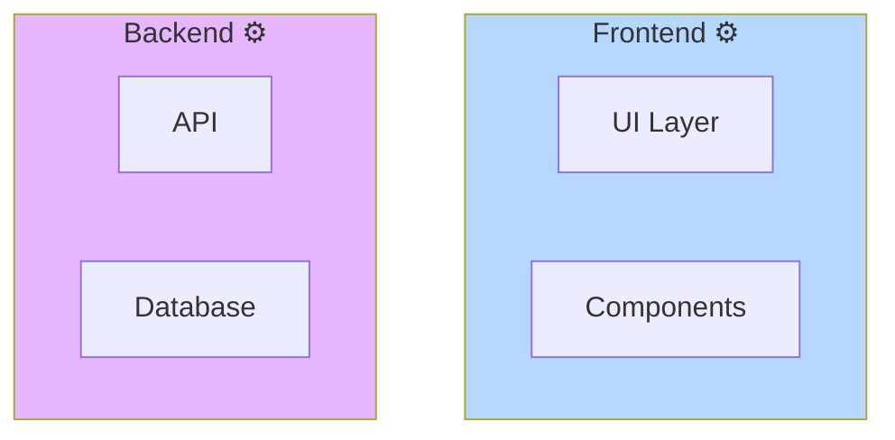

---

## Rendering & Integration

### VS Code Extensions

- **Markdown Preview Mermaid Support** - Built-in preview
- **Mermaid Markdown Syntax Highlighting** - Syntax coloring
- **Mermaid Editor** - Dedicated editor

### Online Tools

- **Mermaid Live Editor** - https://mermaid.live/
- **GitHub** - Native markdown support
- **GitLab** - Native markdown support
- **Notion** - Native support

### Documentation Platforms

- **MkDocs** - With mermaid2 plugin
- **Docusaurus** - With mermaid plugin
- **Hugo** - With shortcode
- **Jekyll** - With plugin

### Programmatic Use

```bash
# Node.js CLI
npm install -g @mermaid-js/mermaid-cli
mmdc -i diagram.mmd -o diagram.png

# Python
pip install mermaid-py
```

---

## Diagram Selection Guide

### When to Use Each Type

| Goal                    | Best Diagram | Why                        |
| ----------------------- | ------------ | -------------------------- |
| Process flow, algorithm | Flowchart    | Clear start/end, decisions |
| System interaction      | Sequence     | Shows message exchange     |
| Object structure        | Class        | Inheritance, relationships |
| State transitions       | State        | Shows all states           |
| Database schema         | ERD          | Relationships, cardinality |
| Timeline, milestones    | Gantt        | Time-based visualization   |
| Proportions, parts      | Pie          | Percentage breakdown       |
| 2x2 categorization      | Quadrant     | Matrix analysis            |
| Hierarchical concepts   | Mindmap      | Tree structure             |
| Data correlation        | XY Chart     | Scatter, line plots        |
| Component connections   | Block        | System architecture        |
| Requirements tracking   | Requirement  | Verification methods       |
| Git history             | Gitgraph     | Branch and merge           |
| User experience         | User Journey | Touchpoints, emotions      |
| System architecture     | C4           | Context, containers        |
| Data flow quantities    | Sankey       | Flow visualization         |
| Chronological events    | Timeline     | Historical view            |

---

## Troubleshooting

### Common Issues

**Syntax Errors**

```
❌ Missing parentheses, brackets
❌ Incorrect arrow types
❌ Mismatched quotes

✅ Validate syntax in Mermaid Live Editor
✅ Check closing braces/brackets
✅ Use consistent quote style
```

**Rendering Issues**

```
❌ Diagram won't display
❌ Formatting looks wrong

✅ Check Mermaid version
✅ Ensure proper indentation
✅ Try different diagram direction
✅ Simplify if too complex
```

**Layout Problems**

```
❌ Labels overlap
❌ Nodes too crowded
❌ Poor readability

✅ Use shorter labels or line breaks
✅ Split into multiple diagrams
✅ Try different direction (TD, LR)
✅ Use subgraphs to organize
```

---

## Quality Checklist

- [ ] Diagram type matches purpose
- [ ] Clear title describing content
- [ ] All labels are descriptive, not vague
- [ ] Consistent styling applied
- [ ] Colors follow semantic meaning
- [ ] Proper hierarchy/grouping shown
- [ ] No ambiguous relationships
- [ ] Accessible color scheme (colorblind safe)
- [ ] Renders correctly in target platform
- [ ] Can be understood by intended audience

---

## Best Practices Summary

### Structure

1. **Clear Purpose** - Title and description
2. **Logical Flow** - Left-to-right, top-to-bottom
3. **Consistent Styling** - Shapes, colors, fonts
4. **Proper Grouping** - Related elements together
5. **Minimal Complexity** - Only necessary details

### Labeling

1. **Clear & Specific** - Action-oriented, descriptive
2. **Concise** - Short, readable text
3. **Consistent Terminology** - Same concepts, same labels
4. **Readable Size** - Font large enough to read

### Design

1. **Color Purpose** - Semantic meaning, not decoration
2. **Shape Meaning** - Consistent for similar items
3. **Arrow Direction** - Flow follows natural reading direction
4. **Spacing** - Adequate whitespace for clarity

### Maintenance

1. **Version Control** - Track diagram changes
2. **Documentation** - Explain complex diagrams
3. **Testing** - Render in target platforms
4. **Updates** - Keep diagrams current with code/processes

---

## Related Documentation

- `draw-mermaid.prompt.md` - Interactive prompt for diagram creation
- `expert-mermaid-diagram-designer.agent.md` - Expert guidance
- Mermaid Documentation: https://mermaid.js.org/
